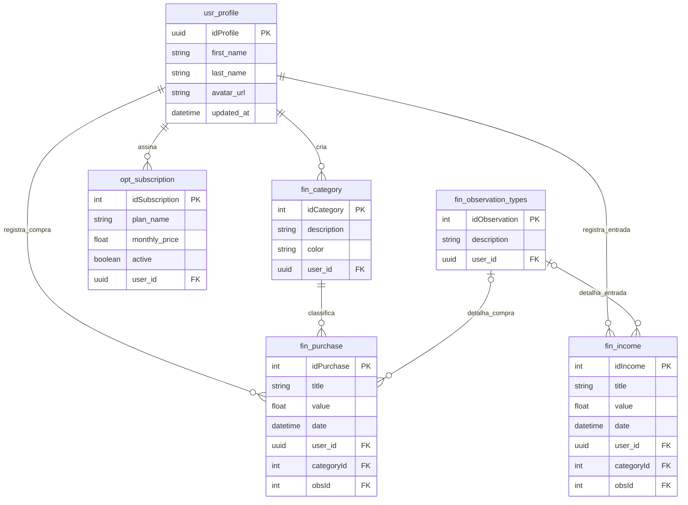

# Sistema Financeiro

## 1. Introdução
A modelagem de banco de dados é uma etapa crucial no desenvolvimento de software, pois garante que a estrutura de armazenamento seja eficiente, íntegra e capaz de refletir as regras de negócio reais do sistema. O objetivo deste trabalho é apresentar a estrutura de dados construída para a aplicação web "Finance AI", um sistema de controle financeiro pessoal.

O sistema Finance AI aborda a dor latente do descontrole financeiro pessoal. Através de um SGBD Relacional (PostgreSQL), o sistema garante a Atomicidade, Consistência, Isolamento e Durabilidade (propriedades ACID) na persistência das transações de inúmeros usuários em tempo real. O desenvolvimento deste trabalho passará pela criação do **Modelo Conceitual** (para capturar as entidades e relacionamentos), **Modelo Lógico** (estruturação tabular e dicionário de dados) e **Modelo Físico** (código SQL), baseados no esquema real desenvolvido com o auxílio do Prisma ORM e PostgreSQL.

## 2. Apresentação do Estudo de Caso
O sistema **Finance AI** nasce da necessidade de ajudar os usuários a organizarem sua vida financeira. Muitas pessoas perdem o controle de seus gastos diários e não conseguem medir de onde vem a maior parte de suas despesas. A aplicação também possui um módulo opcional de assinaturas para monetização e controle de funcionalidades avançadas (SaaS).

O banco de dados resolve o problema de centralizar e persistir as transações financeiras (compras e entradas de um usuário), vinculando-as a categorias personalizadas, perfis de usuário, tipos de observação parametrizáveis e controle rigoroso de planos de assinatura baseados em perfil.

## 3. Levantamento de Requisitos

### 3.1 Requisitos Funcionais
- O sistema deve gerenciar de forma unívoca o perfil do usuário (nome, foto de perfil, timestamps).
- O sistema deve permitir a criação de categorias financeiras personalizáveis por usuário.
- O sistema deve registrar as compras (despesas), vinculadas restritamente a uma categoria.
- O sistema deve registrar entradas (receitas).
- O sistema deve manter um cadastro de tipos de observações (tags/detalhes) para normalização de dados em relatórios.
- O sistema deve gerenciar assinaturas ativas dos usuários em planos específicos (ex: Spotify).

### 3.2 Regras de Negócio
- Um perfil de usuário pode hospedar diversas categorias e possuir diferentes históricos de assinaturas.
- Uma categoria, transação ou assinatura é de propriedade exclusiva e intransferível de um único usuário (Multi-tenancy isolation).
- **Categorização Rigorosa:** Sistemas financeiros exigem que toda despesa (`fin_purchase`) pertença obrigatoriamente (1,1) a uma entidade classificatória (`fin_category`), impedindo a inserção de gastos não categorizados ou órfãos.
- Um tipo de observação pode estar associado a várias compras ou entradas, mas uma transação só tem no máximo uma observação (normalização de descrições repetitivas).
- Uma compra pode prescindir de uma observação associada (cardinalidade mínima 0).
- Uma assinatura deve estar obrigatoriamente vinculada a um perfil de usuário para determinar controle de acesso sistêmico.

---

## 4. Modelo Conceitual (MER)

O modelo foi extraído do banco real do projeto contemplando 6 entidades obrigatórias atreladas ao domínio principal.

### Entidades e Atributos:
1. **usr_profile**: `idProfile` (PK), `first_name`, `last_name`, `avatar_url`, `updated_at`
2. **fin_category**: `idCategory` (PK), `description`, `color`, `user_id`
3. **fin_purchase**: `idPurchase` (PK), `title`, `value`, `date`, `categoryId`, `user_id`, `obsId`
4. **fin_income**: `idIncome` (PK), `title`, `value`, `date`, `user_id`, `categoryId`, `obsId`
5. **fin_observation_types**: `idObservation` (PK), `description`, `user_id`
6. **opt_subscription**: `idSubscription` (PK), `plan_name`, `monthly_price`, `active`, `user_id`

### Relacionamentos e Cardinalidades:
O modelo apresenta 7 relacionamentos:
1. **CRIA (usr_profile -> fin_category)**
   - Cardinalidade: (1,1) Categoria para (1,N) Perfil.
   - *Justificativa:* Toda categoria pertence estritamente ao perfil que a criou. O perfil pode criar várias entidades classificatórias.
2. **REGISTRA_COMPRA (usr_profile -> fin_purchase)**
   - Cardinalidade: (1,1) Compra para (1,N) Perfil.
   - *Justificativa:* O usuário registra várias despesas independentes, e cada despesa provém exclusivamente de um proprietário.
3. **REGISTRA_ENTRADA (usr_profile -> fin_income)**
   - Cardinalidade: (1,1) Entrada para (1,N) Perfil.
   - *Justificativa:* O usuário registra várias receitas, garantindo auditoria de caixa individual.
4. **ASSINA (usr_profile -> opt_subscription)**
   - Cardinalidade: (1,1) Assinatura para (1,N) Perfil.
   - *Justificativa:* O contrato de assinatura pertence a um único perfil de usuário base, podendo existir um histórico consecutivo de assinaturas (N) ao longo do tempo.
5. **CLASSIFICA (fin_category -> fin_purchase)**
   - Cardinalidade: (1,1) Compra para (1,N) Categoria.
   - *Justificativa:* Cada compra requer categorização exata. Uma categoria agrupa N compras atreladas.
6. **DETALHA_COMPRA (fin_observation_types -> fin_purchase)**
   - Cardinalidade: (0,1) Compra para (0,N) Observação.
   - *Justificativa:* A compra pode, opcionalmente (0), receber uma etiqueta (tag) paramétrica, sendo esta etiqueta aplicável a múltiplas instâncias na base.
7. **DETALHA_ENTRADA (fin_observation_types -> fin_income)**
   - Cardinalidade: (0,1) Entrada para (0,N) Observação.
   - *Justificativa:* Espelha o comportamento de gastos, permitindo padronização na taxonomia das fontes de renda.

### Diagrama MER



---

## 5. Modelo Lógico (Dicionário de Dados)

**Tabelas, Chaves (PK/FK) e Tipos de Dados:**

1. **`usr_profile`**
   - `idProfile`: UUID (PK)
   - `first_name`: VARCHAR
   - `last_name`: VARCHAR
   - `avatar_url`: TEXT (Nullable)
   - `updated_at`: TIMESTAMP WITH TIMEZONE

2. **`opt_subscription`**
   - `idSubscription`: INTEGER (PK)
   - `plan_name`: VARCHAR
   - `monthly_price`: DOUBLE PRECISION
   - `active`: BOOLEAN
   - `user_id`: UUID (FK referenciando `usr_profile.idProfile`)

3. **`fin_category`**
   - `idCategory`: INTEGER (PK)
   - `description`: VARCHAR
   - `color`: VARCHAR
   - `user_id`: UUID (FK referenciando `usr_profile.idProfile`)

4. **`fin_observation_types`**
   - `idObservation`: INTEGER (PK)
   - `description`: VARCHAR
   - `user_id`: UUID (FK referenciando `usr_profile.idProfile`)

5. **`fin_purchase`**
   - `idPurchase`: INTEGER (PK)
   - `title`: VARCHAR
   - `value`: DOUBLE PRECISION
   - `date`: TIMESTAMP WITH TIMEZONE
   - `categoryId`: INTEGER (FK referenciando `fin_category.idCategory`)
   - `user_id`: UUID (FK referenciando `usr_profile.idProfile`)
   - `obsId`: INTEGER (Nullable - FK referenciando `fin_observation_types.idObservation`)

6. **`fin_income`**
   - `idIncome`: INTEGER (PK)
   - `title`: VARCHAR
   - `value`: DOUBLE PRECISION
   - `date`: TIMESTAMP
   - `categoryId`: INTEGER (Nullable - FK referenciando `fin_category.idCategory`)
   - `user_id`: UUID (FK referenciando `usr_profile.idProfile`)
   - `obsId`: INTEGER (Nullable - FK referenciando `fin_observation_types.idObservation`)

*(Insira aqui a imagem do Diagrama Lógico exportado, caso o professor requeira um segundo diagrama além do MER.)*

---

## 6. Modelo Físico

```sql
CREATE TABLE usr_profile (
    "idProfile" UUID NOT NULL PRIMARY KEY,
    first_name VARCHAR(100) NOT NULL,
    last_name VARCHAR(100) NOT NULL,
    avatar_url TEXT,
    updated_at TIMESTAMP WITH TIME ZONE NOT NULL
);

CREATE TABLE fin_category (
    "idCategory" SERIAL PRIMARY KEY,
    description VARCHAR(255) NOT NULL,
    color VARCHAR(20) NOT NULL,
    user_id UUID NOT NULL,
    CONSTRAINT fk_user_category FOREIGN KEY (user_id) REFERENCES usr_profile("idProfile") ON DELETE CASCADE
);

CREATE TABLE fin_observation_types (
    "idObservation" SERIAL PRIMARY KEY,
    description VARCHAR(255) NOT NULL,
    user_id UUID NOT NULL,
    CONSTRAINT fk_user_obs FOREIGN KEY (user_id) REFERENCES usr_profile("idProfile") ON DELETE CASCADE
);

CREATE TABLE fin_purchase (
    "idPurchase" SERIAL PRIMARY KEY,
    title VARCHAR(255) NOT NULL,
    value DOUBLE PRECISION NOT NULL,
    date TIMESTAMP WITH TIME ZONE NOT NULL,
    "categoryId" INTEGER NOT NULL,
    user_id UUID NOT NULL,
    "obsId" INTEGER,
    CONSTRAINT fk_user_purchase FOREIGN KEY (user_id) REFERENCES usr_profile("idProfile") ON DELETE CASCADE,
    CONSTRAINT fk_category_purchase FOREIGN KEY ("categoryId") REFERENCES fin_category("idCategory") ON DELETE CASCADE,
    CONSTRAINT fk_obs_purchase FOREIGN KEY ("obsId") REFERENCES fin_observation_types("idObservation") ON DELETE CASCADE
);

CREATE TABLE fin_income (
    "idIncome" SERIAL PRIMARY KEY,
    title VARCHAR(255) NOT NULL,
    value DOUBLE PRECISION NOT NULL,
    date TIMESTAMP WITHOUT TIME ZONE NOT NULL,
    user_id UUID NOT NULL,
    "categoryId" INTEGER,
    "obsId" INTEGER,
    CONSTRAINT fk_user_income FOREIGN KEY (user_id) REFERENCES usr_profile("idProfile") ON DELETE CASCADE,
    CONSTRAINT fk_category_income FOREIGN KEY ("categoryId") REFERENCES fin_category("idCategory") ON DELETE SET NULL,
    CONSTRAINT fk_obs_income FOREIGN KEY ("obsId") REFERENCES fin_observation_types("idObservation") ON DELETE SET NULL
);

CREATE TABLE opt_subscription (
    "idSubscription" SERIAL PRIMARY KEY,
    plan_name VARCHAR(255) NOT NULL,
    monthly_price DOUBLE PRECISION NOT NULL,
    active BOOLEAN NOT NULL DEFAULT TRUE,
    user_id UUID NOT NULL,
    CONSTRAINT fk_user_subscription FOREIGN KEY (user_id) REFERENCES usr_profile("idProfile") ON DELETE CASCADE
);
```

---

## 7. Conclusão
O exercício de documentar o projeto de banco de dados do `Finance AI` evidenciou a criticidade do planejamento estrutural prévio. As regras de negócio levantadas deixam de ser validações triviais de interface e passam a ser blindagens de estado consistentes na camada de dados via PostgreSQL e Prisma ORM. 

O mapeamento rigoroso através das "Foreign Keys" assegurou a Integridade Referencial em cascata de todo o sistema. Esta base relacional, modelada segundo a teoria clássica e implementada em um ecossistema nativo para nuvem, comprova que a arquitetura do banco de dados dita a longevidade, a integridade da informação e a capacidade de escala de aplicações SaaS no mundo real.

## 8. Referências
- PICHETTI, Roni F.; VIDA, Edinilson S.; CORTES, Vanessa S. M P. Banco de dados. Porto Alegre: Grupo A, 2021. E-book. ISBN 9786556900186. Disponível em: https://integrada.minhabiblioteca.com.br
- Documentação oficial da sintaxe declarativa Prisma ORM e dialeto PostgreSQL.